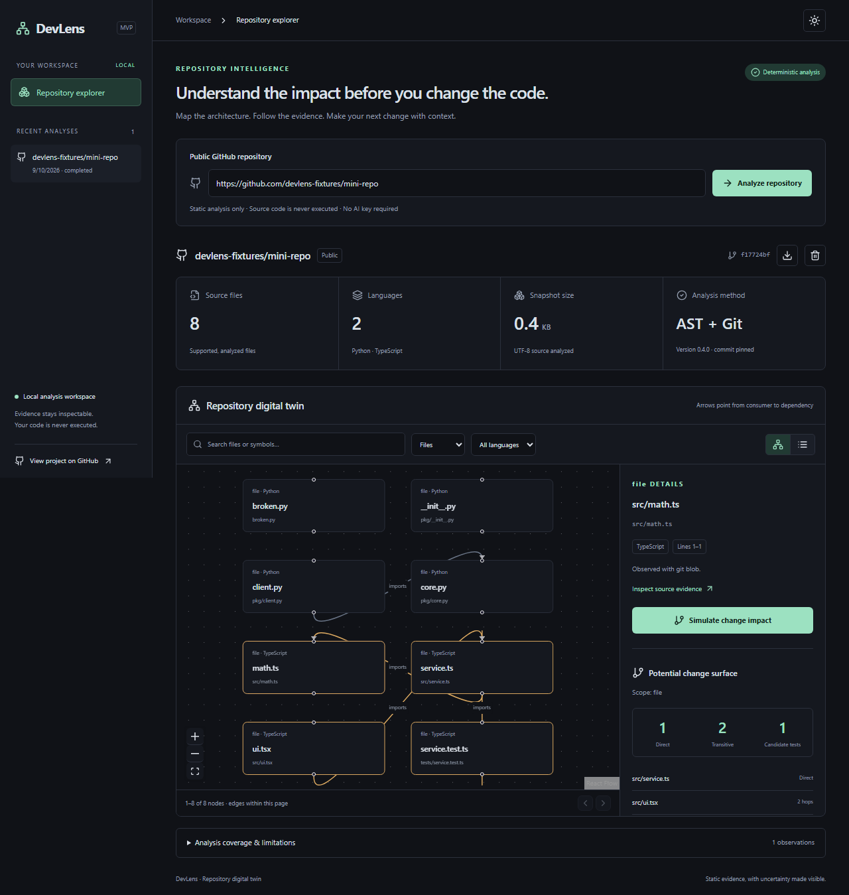

# DevLens AI

**Repository Digital Twin & Engineering Intelligence**

See your codebase. Understand its past. Predict the impact of its future.

DevLens maps a repository's files, declarations and imports at a specific Git commit.
Select a file to trace its direct consumers, transitive dependents and candidate tests,
then inspect the source lines behind every relationship. It works without an AI key.



*Actual product UI using the test-only `devlens-fixtures/mini-repo` fixture. The fixture
URL is an isolated browser-test adapter, not a published GitHub repository or production analysis.*

**Status:** early local MVP covering the v0.1–v0.4 workflow. History intelligence,
architecture rules, risk models and AI interpretation are planned. Static reachability
shows a potential change surface; it does not predict that a change will break code.

## What works

- Public GitHub ingestion with URL allowlisting, isolated Git and bounded resources.
- TypeScript/TSX and JavaScript/JSX declarations and literal ES imports through Tree-sitter.
- Python classes, functions, methods and imports through the standard AST parser.
- A persisted, commit-pinned graph with file/declaration nodes and containment/import edges.
- Search, language/type filters, graph pan/zoom, node details, source links, list view,
  dark/light themes and paginated graph rendering.
- Direct and transitive impact with shortest evidence paths and filename-based candidate tests.
- Analysis progress, explicit failures, coverage limitations, JSON export and deletion.
- PostgreSQL migrations, a SQLite local mode, tests and GitHub Actions workflows.

## Quick start with Docker

```sh
git clone --branch feat/devlens-mvp https://github.com/dhaneshit008/devlens.git
cd devlens
cp .env.example .env
docker compose up --build
```

Open **http://localhost:8080**. Enter a public GitHub repository URL. FastAPI's API
documentation is at **http://localhost:8000/docs**. Compose supplies PostgreSQL internally;
its database has no published host port. The local development database uses trust
authentication on an isolated Docker network. Replace this with secret-managed
authentication before any shared deployment.

The MVP has no user authentication. Keep it bound to loopback. See [SECURITY.md](SECURITY.md).
Docker validation status and other environment exceptions belong in [BUILD_REPORT.md](BUILD_REPORT.md).

## Local development

Requirements: Python 3.12+, Node.js 22.12+ (24 recommended), Git, and optionally PostgreSQL.

```sh
python -m venv .venv
source .venv/bin/activate
pip install -c requirements.lock -e '.[dev]'
alembic upgrade head
uvicorn devlens.main:app --host 127.0.0.1 --port 8000 --workers 1
```

In a second terminal:

```sh
npm ci
npm run dev
```

Open **http://127.0.0.1:5173**. Vite proxies API requests to port 8000.
On Windows use `.venv\Scripts\Activate.ps1` instead of `source`. Without `DATABASE_URL`,
local development uses `devlens.db` in the working directory. PostgreSQL uses
`postgresql+psycopg://user@host:5432/database`; put any password in an environment variable,
never in Git. Run migrations after setting the database URL. Use exactly one API worker.

## Reproduce an analysis locally

```sh
python scripts/analyze_local.py /path/to/repository --output snapshot.json
python scripts/analyze_local.py /path/to/repository --impact src/service.ts
```

These commands analyze the repository's committed `HEAD`, including when the working
tree is dirty. They do not execute its code. A stable installed `devlens` CLI is planned.
Generated snapshots are real results, not demo data. To experiment without a large
repository, use the deterministic fixture in the test suite.

## Checks

```sh
ruff check services tests scripts
ruff format --check services tests scripts
mypy
pytest -q
python -m build
npm run lint
npm run typecheck
npm test
npm run build
cd apps/web
npx playwright install chromium
cd ../..
npm run test:e2e
```

The browser test uses an isolated **test-only fixture server** and a real committed
fixture repository. It does not depend on live GitHub. The public clone smoke test is
performed separately. CI additionally tests PostgreSQL migrations and Docker startup.
Only point `DEVLENS_TEST_DATABASE_URL` at a disposable database: migration tests reset its schema.

## Architecture and evidence

React/Vite → FastAPI modular monolith → isolated Git objects → syntax parsers → graph
and impact analysis → PostgreSQL snapshot → explorer.

An import edge points **from consumer to dependency**. Impact follows these edges in
reverse. Direct imports are observed statically; transitive propagation is inferred.
Every edge records a file, line range and extraction method. Evidence links include the
snapshot commit SHA. Selecting a symbol currently analyzes its **containing file**;
DevLens does not claim symbol-level runtime precision.

Supported source is bounded to 2,000 files, 500 KB per file and 20 MB total by default.
Clone storage is limited to approximately 200 MB and clone time to 90 seconds. Large
graphs are rejected rather than silently truncated; graph pages show at most 100 nodes
in the UI. See [analysis methodology](docs/analysis-engine.md) for all resolution limits.

No health score, bug probability, coverage percentage or architecture relationship is
invented. Unresolved imports, parse errors and skipped files remain visible.

## Documentation

- [Product specification](PROJECT_SPEC.md) · [Architecture](ARCHITECTURE.md) · [Roadmap](ROADMAP.md)
- [Analysis engine](docs/analysis-engine.md) · [Digital twin](docs/digital-twin.md) · [Change impact](docs/change-impact.md)
- [API](docs/api.md) · [Local development](docs/local-development.md) · [Deployment](docs/deployment.md)
- [Privacy](docs/privacy-architecture.md) · [Scoring policy](docs/scoring-methodology.md)
- [Architecture decisions](docs/adr/0001-core-decisions.md) · [Changelog](CHANGELOG.md)

## Contributing

Read [CONTRIBUTING.md](CONTRIBUTING.md), [CODE_OF_CONDUCT.md](CODE_OF_CONDUCT.md) and
[GOVERNANCE.md](GOVERNANCE.md). Focused parser fixtures, accessibility improvements and
resolution tests are useful contributions. No issues, stars or contributor statistics
have been manufactured. Report vulnerabilities using [SECURITY.md](SECURITY.md).

Creator & lead maintainer: **Dhanesh M V**. Licensed under the existing
[Apache License 2.0](LICENSE).
